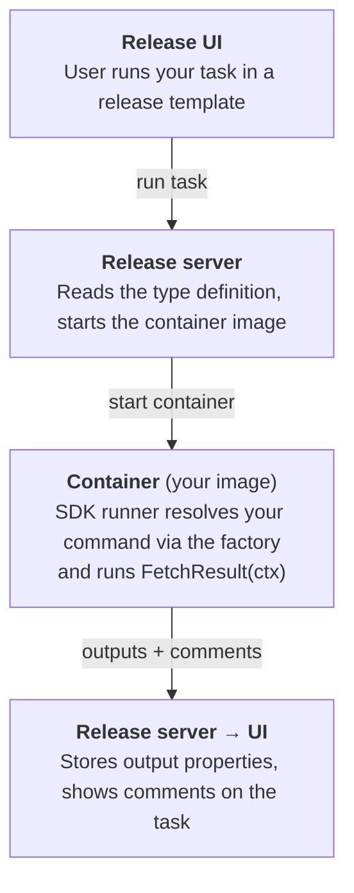

# Plugin Development Guide

A practical guide to building Digital.ai Release **container plugins** with this Go template.
It explains how the pieces fit together, how to add your own task, and how each bundled example
was built.

> [!TIP]
> New here? Read [How a container plugin works](#how-a-container-plugin-works) first,
> then jump to [Add a new task — step by step](#add-a-new-task--step-by-step).
>
> **AI agents:** start with [AGENTS.md](AGENTS.md) for the conventions and guardrails, then
> use the [`SKILL.md`](SKILL.md) skill (covers setup, adding a task, and build/deploy). This
> guide is the detailed reference behind both.

## Contents

- [How a container plugin works](#how-a-container-plugin-works)
- [The two building blocks](#the-two-building-blocks)
- [The naming contract: type ↔ command](#the-naming-contract-type--command)
- [Anatomy of a task](#anatomy-of-a-task)
- [Property kinds reference](#property-kinds-reference)
- [Add a new task — step by step](#add-a-new-task--step-by-step)
- [Abort support](#abort-support)
- [The example tasks explained](#the-example-tasks-explained)
- [Testing your task](#testing-your-task)
- [Build, install, run](#build-install-run)
- [The development environment](#the-development-environment)
- [Troubleshooting](#troubleshooting)
- [Production deployment (Kubernetes)](#production-deployment-kubernetes)
- [Related resources](#related-resources)

## How a container plugin works

A container plugin contributes new **task types** to Release. When a user runs one of
your tasks, Release does roughly this:



1. **Type definition** ([`resources/type-definitions.yaml`](../resources/type-definitions.yaml))
   tells Release the task exists, what inputs/outputs it has, and which container image to run.
2. **Build** (`build.sh` / `build.bat`) produces two artifacts: a **plugin zip** (the type
   definitions + icons) installed into Release, and a **Docker image** (your compiled Go binary)
   pushed to a registry.
3. **At run time**, Release starts the image as a container. The entrypoint is your binary
   (see the [`Dockerfile`](../Dockerfile) and [`main.go`](../main.go)), which calls
   `runner.Execute(...)` from the SDK. The runner receives the task's input properties, resolves
   the matching **command** through the factory (see
   [The naming contract](#the-naming-contract-type--command)), calls its `FetchResult(ctx)`
   method, and sends the output properties and comments back to Release.

You write two things: the **type definition** (YAML) and the **command** (Go struct + factory
entry + `FetchResult`). The SDK runner handles everything in between.

## The two building blocks

### 1. The type definition (`resources/type-definitions.yaml`)

Declares the task to Release. Minimal example:

```yaml
types:
  goContainerExamples.Hello:
    extends: goContainerExamples.BaseTask     # inherits the image location + styling
    label: "Container Examples: Hello (Go)"
    description: Simple greeter task

    input-properties:
      yourName:
        description: The name to greet
        kind: string
        default: World

    output-properties:
      greeting:
        kind: string
```

All tasks in this project extend `goContainerExamples.BaseTask`, a `virtual` (abstract)
type that sets the container image once for every task:

```yaml
  goContainerExamples.BaseTask:
    extends: xlrelease.ContainerTask
    virtual: true
    hidden-properties:
      image:
        default: "@registry.url@/@registry.org@/@project.name@:@project.version@"
        transient: true
      iconLocation: test.png
      taskColor: "#667385"
```

The `@...@` placeholders are filled in from [`project.properties`](../project.properties) by
the build script, so the image tag always matches what you just built. A second virtual type,
`goContainerExamples.BaseScript` (extends `xlrelease.RemoteScriptExecution`), is the base for
**scripts** — test-connection and lookup tasks that return a `commandResponse` map.

> [!TIP]
> Release also accepts the classic `type-definitions.xml` format. The two files are **merged**,
> so each type must be declared in **one** file only — don't define the same type in both.

### 2. The command (`my-integration/cmd`)

A task is a Go **command**: a struct holding its inputs plus a `FetchResult` method that does the
work. Three files collaborate:

- [`cmd/commands.go`](../my-integration/cmd/commands.go) — the struct with `json`-tagged input
  fields (and any injected clients).
- [`cmd/factory.go`](../my-integration/cmd/factory.go) — the type constant and the
  `commandHatchery` entry that constructs the struct.
- [`cmd/executors.go`](../my-integration/cmd/executors.go) — the `FetchResult` implementation
  (thin; delegates to a file under `cmd/example/`).

```go
// cmd/commands.go
type Hello struct {
    YourName string `json:"yourName"`
}
```

```go
// cmd/factory.go
const hello = "goContainerExamples.Hello"

var commandHatchery = map[command.CommandType]func(*CommandFactory) command.CommandExecutor{
    hello: func(factory *CommandFactory) command.CommandExecutor {
        return &Hello{}
    },
    // ...
}
```

```go
// cmd/executors.go
func (command *Hello) FetchResult(ctx context.Context) (*task.Result, error) {
    return example.Hello(command.YourName)
}
```

## The naming contract: type ↔ command

This is the one rule you must get right. Release sends the **task type** (e.g.
`goContainerExamples.Hello`) to the container, and the SDK runner looks it up in the
`commandHatchery` map to build the command. For every task, keep these aligned:

```
  type-definitions.yaml            cmd/factory.go               cmd/commands.go / executors.go
  goContainerExamples.Hello  ⇄     commandHatchery["...Hello"]  ⇄  type Hello struct + FetchResult
          └──────────── the same type string ────────────┘
```

Consequences:

- The **type string must match exactly** in the YAML and as the `commandHatchery` key (usually via
  a `const`).
- Every registered type needs a **struct** and a **`FetchResult`** — a factory entry with no struct
  won't compile; a type in the YAML with no factory entry fails at run time with
  `unknown command type`.
- Input **`json` tags** on the struct must match the `input-properties` names in the YAML, or the
  SDK deserializer leaves the field empty.

## Anatomy of a task

Every command implements **`FetchResult(ctx context.Context) (*task.Result, error)`**. Inside it:

| Element | Purpose |
|---------|---------|
| Struct fields with `json:"..."` tags | The task's input properties, deserialized by the SDK. |
| `task.NewResult()` | Builds the result. Chain setters like `.String(name, value)` for output properties, and comment/status helpers. |
| `return result, nil` | Success — the result's output properties and comments go back to Release. |
| `return nil, err` | **Failure** — return a non-nil error to fail the task; the message is shown to the user. Wrap with context. |
| `ctx context.Context` | Required on every command; carries cancellation used for [abort](#abort-support). |

Injected clients (wired in [`main.go`](../main.go) and passed through the factory):

- **`releaseClient`** (`*openapi.APIClient`) — call the **Release** REST API. Built from the task's
  "Run as user" context.
- **`httpClient`** (`*http.HttpClient`) — call a **third-party** server, built from a server
  connection CI (`goContainerExamples.Server`).

> [!IMPORTANT]
> **"Run as user" matters.** Release API calls execute as the release's Run-as user. If that user
> is not set or lacks permission, API calls fail. For local testing, the dev-environment server
> (`localhost:5516`, `admin`/`admin`) has a working runner.

## Property kinds reference

The common `kind` values used in `input-properties` / `output-properties`:

| `kind` | Go type you receive | Notes |
|--------|---------------------|-------|
| `string` | `string` | Plain text. Add `default:` for a default value. |
| `integer` | `int` | Whole number. |
| `boolean` | `bool` | Checkbox. |
| `date` | `string` (ISO-8601) | Date/time value. |
| `map_string_string` | `map[string]string` | Key/value pairs. |
| `list_of_string` | `[]string` | List of strings. |
| `ci` | struct / connection | A reference to a configuration item; use `referenced-type:` to constrain it (e.g. a server connection). |

Other useful field options:

- `description:` — shown as help text in the UI.
- `default:` — pre-filled value.
- `required: true` — the UI enforces a value.
- `hidden-properties:` — properties not shown to the user (e.g. the container `image`).
- `input-hint: { method-ref: ... }` — drives a dropdown from a **lookup** script (see
  `HelloWithLookup` below).

A **server connection** is just a CI type that extends a Release connection type, so users
can pick a saved connection:

```yaml
  goContainerExamples.Server:
    extends: configuration.BasicAuthHttpConnection
    hidden-properties:
      testConnectionScript: goContainerExamples.TestConnection
    properties:
      url:
        default: https://dummyjson.com
        required: true
```

## Add a new task — step by step

Suppose you want a task that reverses a string.

**1. Declare the type** in [`resources/type-definitions.yaml`](../resources/type-definitions.yaml):

```yaml
  goContainerExamples.Reverse:
    extends: goContainerExamples.BaseTask
    label: "Container Examples: Reverse (Go)"
    description: "Reverses the given text"
    input-properties:
      text:
        kind: string
        required: true
    output-properties:
      reversed:
        kind: string
```

**2. Add the struct** in [`cmd/commands.go`](../my-integration/cmd/commands.go) — the `json` tag
matches the input name:

```go
type Reverse struct {
    Text string `json:"text"`
}
```

**3. Register it** in [`cmd/factory.go`](../my-integration/cmd/factory.go):

```go
const reverse = "goContainerExamples.Reverse"

// inside commandHatchery:
reverse: func(factory *CommandFactory) command.CommandExecutor {
    return &Reverse{}
},
```

**4. Implement `FetchResult`** in [`cmd/executors.go`](../my-integration/cmd/executors.go)
(keep the logic in its own file under `cmd/example/`):

```go
func (command *Reverse) FetchResult(ctx context.Context) (*task.Result, error) {
    if command.Text == "" {
        return nil, fmt.Errorf("the 'text' field cannot be empty")
    }
    runes := []rune(command.Text)
    for i, j := 0, len(runes)-1; i < j; i, j = i+1, j-1 {
        runes[i], runes[j] = runes[j], runes[i]
    }
    return task.NewResult().String("reversed", string(runes)), nil
}
```

**5. Test it** ([Testing your task](#testing-your-task)), then **build & install** — bump
`VERSION` in `project.properties` and run the build ([Build, install, run](#build-install-run)).
Add the task to a template and run it.

That's the whole loop: **declare → struct → factory → `FetchResult` → test → build → run.**

## Abort support

Abort is opt-in per task. See the bundled `hello` example and
[`cmd/example`](../my-integration/cmd/example).

1. In [`cmd/factory.go`](../my-integration/cmd/factory.go), register an abort command using
   `command.AbortCommand(<existingType>)` as the key (e.g.
   `command.AbortCommand(hello): func(...) { return &AbortHello{} }`).
2. In [`cmd/commands.go`](../my-integration/cmd/commands.go), define a struct holding whatever the
   abort logic needs.
3. In [`cmd/executors.go`](../my-integration/cmd/executors.go), implement `FetchResult` on that
   struct.

Always thread `context.Context` through your task logic — cancellation is how abort reaches
in-flight work.

## The example tasks explained

The template ships a set of examples, each demonstrating one capability. Use them as
starting points.

| Type (YAML) | Command (`cmd/`) | Demonstrates |
|-------------|------------------|--------------|
| `goContainerExamples.Hello` | `Hello` | The minimal task: read an input, return an output property. |
| `goContainerExamples.SetSystemMessage` | `SetSystemMessage` | Calling the **Release** REST API via the injected `releaseClient`. |
| `goContainerExamples.ServerQuery` | `ServerQuery` | Calling a **third-party** HTTP API using a `ci` server connection (`httpClient`). |
| `goContainerExamples.TestConnection` | `TestConnectionCommand` | A **test-connection** script for a server CI (`test.TestConnection`). |
| `goContainerExamples.NameLookup` | `LookupNames` | A **lookup** script that returns `{label, value}` options for a dropdown. |
| `goContainerExamples.HelloWithLookup` | `HelloWithLookup` | An input whose value is chosen from a lookup (`input-hint.method-ref`). |
| `command.AbortCommand(hello)` | `AbortHello` | [Abort](#abort-support) handling for a running task. |

### How the key examples were built

**`Hello` — the baseline.** Reads `YourName` from the struct, delegates to `example.Hello`, and
returns a `greeting` output property via `task.NewResult().String(...)`. Every other task follows
this shape.

**`ServerQuery` — third-party API + connection CI.** The `server` input is a `ci` referencing
`goContainerExamples.Server` (a `BasicAuthHttpConnection`). `main.go` deserializes the connection
and builds an `httpClient`, which the factory injects into the command. This is the pattern for
integrating any external system: model the connection as a CI, call it with the SDK HTTP client.

**`SetSystemMessage` — Release API.** Uses the injected `releaseClient` (`*openapi.APIClient`),
built from the task's "Run as user" context, to call the Release REST API.

**`TestConnection` — validating a connection.** Registered on the `Server` CI as its
`testConnectionScript`, so the **Test** button in the connection dialog runs it. It uses
`test.TestConnection` with a connection tester under `cmd/connection/`.

**`NameLookup` + `HelloWithLookup` — dynamic dropdowns.** `NameLookup` returns a list of
`{label, value}` entries. `HelloWithLookup` wires its `yourName` input to that script via
`input-hint.method-ref` / `methods`, so the field becomes a populated dropdown.

## Testing your task

Integration tests live in [`test/integration_test.go`](../test/integration_test.go) and use
**GoConvey**. Each case is a folder under `test/testdata/` with an `input.json` (the task input)
and `expected.json` (the expected output); external HTTP calls are stubbed with mock responses
from `test/fixtures/`.

To add a test:

1. Create a folder under `test/testdata/` with `input.json` and `expected.json`.
2. Add the folder name to the `testsLabels` variable in `test/integration_test.go`.
3. If the task makes HTTP calls, add a JSON response under `test/fixtures/` and register a
   `test.MockResult{}` in `commandRunner`.

Run the tests from the repo root:

```sh
go test ./...             # everything
go test -v ./test/...     # integration tests, verbose
```

## Build, install, run

The full build/install/run instructions live in the README:

- [Run Release locally](../README.md#run-release-locally)
- [Build & publish](../README.md#build--publish)
- [Install the plugin into Release](../README.md#install-the-plugin-into-release)

The short version: bump `VERSION` in [`project.properties`](../project.properties), run
`./build.sh` (or `build.bat`) to build the zip + image and push the image, then
`./build.sh --upload` to install the zip into Release. Add your task to a template and run it.

## The development environment

The [`docker-compose.yaml`](../docker-compose.yaml) stack (with its build contexts and config in
[`dev-environment/`](../dev-environment/)) runs a complete local Release setup to test plugins
against:

| Service | Port | Purpose |
|---------|------|---------|
| `digitalai-release` | `5516` | Release server (login `admin` / `admin`). |
| `digitalai-release-setup` | — | Applies the initial instance configuration, then exits. |
| `digitalai-release-remote-runner` | — | Runs container tasks in Docker mode (uses `network_mode: host`). |
| `container-registry` | `5050` | Docker registry that holds your plugin images. |
| `container-registry-ui` | `8086` | Web UI for the registry. |

Start it and wait for the Release log line `Digital.ai Release has started.`, then open
<http://localhost:5516>:

```sh
docker compose up -d --build
```

**Hosts file.** The registry is addressed by name, so the image you push (`container-registry:5050/...`)
resolves both when building and when Release pulls it. Add to `/etc/hosts` (Unix/macOS) or
`C:\Windows\System32\drivers\etc\hosts` (Windows, as administrator):

```
127.0.0.1 container-registry
```

The compose stack also uses `host.docker.internal` (the server's `SERVER_URL`). Docker Desktop
(macOS/Windows) provides this automatically; on Linux add `127.0.0.1 host.docker.internal` too.

**Reset** (clears server state — fixes most "stuck" issues):

```sh
docker compose down
docker compose up -d --build
```

## Troubleshooting

| Symptom | Cause / fix |
|---------|-------------|
| Release won't start: `Trying to register duplicate definition for type ...` | A type is defined twice (often a leftover from a previous install). **Reset** the dev environment. |
| Release log stuck at `Waiting for changelog lock...` | Stale DB lock. **Reset** the dev environment. |
| `Could not find a type definition associated with type [...]` | A type name or an `extends:` reference in `type-definitions.yaml` is inconsistent. Make the names match; reset if needed. |
| Run-time error `unknown command type [...]` | The [naming contract](#the-naming-contract-type--command) is broken: the type in `type-definitions.yaml` has no matching key in `commandHatchery`. |
| A task's input field is empty at run time | The struct's `json` tag doesn't match the `input-properties` name in the YAML. |
| Your task is missing from the **Add task** menu, or its properties don't show | UI cache. Hard-refresh the browser (Ctrl/Cmd+Shift+R). No server restart needed. |
| Image push fails | `container-registry` is not in your hosts file, or the registry container is down. Check `curl http://container-registry:5050/v2/_catalog`. |
| Apple Silicon: `qemu: uncaught target signal 11` | Enable **Rosetta** in Docker Desktop → *Features in development*. |
| Compose fails to start | Port conflict on `5516`, `5050`, or `8086`. Free the port or remap it. |

## Production deployment (Kubernetes)

In production, container tasks run on a Kubernetes cluster via the **Release Runner**, which
registers itself with the Release server over an **outbound** connection (no inbound access to
the cluster needed) and launches a **pod** from your plugin's image for each task.

The plugin you build here is unchanged — only *where the image runs* differs from the local
Docker-mode runner. Just make sure your image is in a registry the cluster can pull from. See
the Digital.ai Release documentation for the Runner installation steps.

## Related resources

See [README → Related resources](../README.md#related-resources).
